# Project Flowcharts: Advanced Customer Service AI

**Visual representations of system architecture, data flows, and agent interactions.**

Last Updated: November 1, 2025

---

## Table of Contents

1. [High-Level System Flow](#1-high-level-system-flow)
2. [Detailed Request-Response Flow](#2-detailed-request-response-flow)
3. [Agent Routing Decision Flow](#3-agent-routing-decision-flow)
4. [Retrieval Strategy Comparison](#4-retrieval-strategy-comparison)
5. [Phase 6: Dynamic Model Selection](#5-phase-6-dynamic-model-selection)
6. [Data Ingestion Pipeline](#6-data-ingestion-pipeline)
7. [Conversation State Management](#7-conversation-state-management)

---

## 1. High-Level System Flow

**Overview**: Complete user journey from message input to response display.


**Key Components**:
- 🟡 **Yellow**: Supervisor Agent (routing hub)
- 🟢 **Green**: Worker Agents (specialized processing)
- 🟠 **Orange**: Vector Database (dynamic retrieval)
- 🔴 **Red**: Static/Cached Data (fast access)

---

## 2. Detailed Request-Response Flow

**Overview**: Sequence diagram showing message flow through all system layers.


**Timeline**:
1. **Frontend** (~50ms): User input, validation
2. **API** (~20ms): Request parsing
3. **Supervisor** (~200ms): Nova Lite routing decision
4. **Worker** (~1500ms): ChromaDB search + GPT-5 generation
5. **Response** (~50ms): Format and return
6. **Total**: ~1.8 seconds end-to-end

---

## 3. Agent Routing Decision Flow

**Overview**: How the supervisor analyzes queries and routes to appropriate workers.


**Routing Logic**:
- **Tool Descriptions**: Supervisor uses tool descriptions to determine intent
- **Keyword Analysis**: Nova Lite identifies domain-specific terms
- **Clarification**: Ambiguous queries trigger clarification questions
- **Fallback**: General queries handled by supervisor directly

---

## 4. Retrieval Strategy Comparison

**Overview**: Side-by-side comparison of three retrieval strategies.


**Strategy Details**:

| Strategy | When to Use | Speed | Cost | Freshness |
|----------|------------|-------|------|-----------|
| **Pure RAG** | Dynamic, frequently updated knowledge | Slower | Higher | Always current |
| **Hybrid RAG/CAG** | Stable within session, changes periodically | Fast after first query | Medium | Session-level |
| **Pure CAG** | Completely static content | Fastest | Lowest | Static (restart to update) |

---

## 5. Phase 6: Dynamic Model Selection

**Overview**: Intelligent model selection based on query complexity (Phase 6 enhancement).

```mermaid
graph TD
    Start([Query Arrives at Supervisor]) --> Middleware[Dynamic Model Selection<br/>Middleware]
    
    Middleware --> Analyze[Analyze Query Complexity]
    
    Analyze --> Length{Message<br/>Length?}
    Length -->|"> 50 words"| Score1[+0.2 complexity]
    Length -->|"> 100 words"| Score2[+0.4 complexity]
    Length -->|"< 50 words"| Score0[+0.0 complexity]
    
    Score1 --> Multi
    Score2 --> Multi
    Score0 --> Multi
    
    Multi{Multiple<br/>Questions?} -->|Yes| Score3[+0.2 complexity]
    Multi -->|No| Conditional
    
    Score3 --> Conditional
    Conditional{Conditional<br/>Language?} -->|Yes<br/>"if/but/however"| Score4[+0.2 complexity]
    Conditional -->|No| Vague
    
    Score4 --> Vague
    Vague{Vague<br/>Language?} -->|Yes<br/>"maybe/not sure"| Score5[+0.3 complexity]
    Vague -->|No| History
    
    Score5 --> History
    History{Long<br/>Conversation?} -->|"> 10 messages"| Score6[+0.1 complexity]
    History -->|No| Calculate
    
    Score6 --> Calculate
    Calculate[Calculate Total<br/>Complexity Score]
    
    Calculate --> Threshold{Score >= 0.6?}
    
    Threshold -->|No<br/>"Simple Query"| Nova[Use AWS Nova Lite<br/>⚡ Ultra-fast<br/>💰 $0.00006/1K tokens]
    Threshold -->|Yes<br/>"Complex Query"| Claude[Use Claude 3.5 Haiku<br/>🧠 Better reasoning<br/>💰 $0.0008/1K tokens]
    
    Nova --> Log1[Log: Model Selection<br/>Complexity Score]
    Claude --> Log2[Log: Model Selection<br/>Complexity Score]
    
    Log1 --> Process[Process with<br/>Selected Model]
    Log2 --> Process
    
    Process --> End([Route to Worker Agent])
    
    style Nova fill:#90EE90,stroke:#333,stroke-width:3px
    style Claude fill:#FFD700,stroke:#333,stroke-width:3px
    style Threshold fill:#f9d71c,stroke:#333,stroke-width:3px
```

**Complexity Factors**:
1. **Message Length**: Longer messages often indicate complexity
2. **Multiple Questions**: More than one question increases complexity
3. **Conditional Language**: "If/then", "either/or" indicates nuance
4. **Vague Language**: "Maybe", "not sure" requires interpretation
5. **Conversation History**: Long conversations need more context

**Example Scores**:
- "How much is Pro?" → 0.0 → Nova Lite
- "My app crashes" → 0.0 → Nova Lite
- "If I upgrade mid-month, how is billing prorated?" → 0.4 → Nova Lite
- "I'm not sure if my issue is billing or technical" → 0.7 → Claude 3.5 Haiku

---

## 6. Data Ingestion Pipeline

**Overview**: Process for loading and vectorizing documents into ChromaDB.

```mermaid
graph TB
    Start([Run ingest_data.py]) --> Scan[Scan docs/ directory]
    
    Scan --> Tech[Load Technical Docs]
    Scan --> Bill[Load Billing Docs]
    Scan --> Comp[Load Compliance Docs]
    
    Tech --> PDF[PyPDFLoader<br/>*.pdf files]
    Tech --> MD[UnstructuredMarkdownLoader<br/>*.md files]
    Tech --> TXT1[TextLoader<br/>*.txt files]
    
    Bill --> TXT2[TextLoader<br/>*.txt files]
    
    Comp --> TXT3[TextLoader<br/>*.txt files]
    
    PDF --> Meta1[Add Metadata:<br/>category: technical<br/>source_file: name]
    MD --> Meta1
    TXT1 --> Meta1
    
    TXT2 --> Meta2[Add Metadata:<br/>category: billing<br/>source_file: name]
    
    TXT3 --> Meta3[Add Metadata:<br/>category: compliance<br/>source_file: name]
    
    Meta1 --> Combine[Combine All Documents]
    Meta2 --> Combine
    Meta3 --> Combine
    
    Combine --> Count1[Document Count:<br/>~10-20 raw documents]
    
    Count1 --> Split[RecursiveCharacterTextSplitter<br/>chunk_size: 1000<br/>chunk_overlap: 200]
    
    Split --> Count2[Chunk Count:<br/>~100-200 chunks]
    
    Count2 --> Embed[Create Embeddings<br/>OpenAI text-embedding-3-small<br/>Dimensions: 1536]
    
    Embed --> Store[(Store in ChromaDB<br/>./chroma_db/<br/>Persistent Storage)]
    
    Store --> Verify[Verify Document Count<br/>Query Collection]
    
    Verify --> Success{Success?}
    
    Success -->|Yes| End([Ingestion Complete ✓<br/>Ready for Queries])
    Success -->|No| Error([Error: Check Logs<br/>Retry Ingestion])
    
    style Store fill:#ffd3b6,stroke:#333,stroke-width:3px
    style Embed fill:#a8e6cf,stroke:#333,stroke-width:2px
    style End fill:#90EE90,stroke:#333,stroke-width:2px
    style Error fill:#ff6b6b,stroke:#333,stroke-width:2px
```



**Pipeline Steps**:
1. **Scan**: Recursively find all documents in `docs/` directory
2. **Load**: Use appropriate loader per file type (PDF, Markdown, Text)
3. **Metadata**: Tag each document with category and source file
4. **Split**: Break into 1000-character chunks with 200-char overlap
5. **Embed**: Generate vector embeddings using OpenAI
6. **Store**: Persist to ChromaDB with metadata
7. **Verify**: Count documents to ensure success

**Command**:
```bash
python -m backend.data.ingest_data
```

---

## 7. Conversation State Management

**Overview**: How conversation history and session state are maintained across messages.

```mermaid
graph TB
    subgraph First["First Message in Conversation"]
        direction TB
        M1[User: "My app crashes"] --> S1[Frontend generates UUID<br/>session_id: abc-123]
        S1 --> C1[POST /chat<br/>session_id: abc-123]
        C1 --> O1[Orchestrator creates config<br/>thread_id: abc-123]
        O1 --> CP1[Checkpointer:<br/>NEW thread created]
        CP1 --> A1[Agent processes message<br/>No previous context]
        A1 --> Save1[Save to checkpointer:<br/>messages array:<br/>1. user: My app crashes<br/>2. assistant: Try clearing cache...]
        Save1 --> Resp1[Return response to user]
    end
    
    subgraph Second["Second Message (Follow-up)"]
        direction TB
        Resp1 -.->|User continues| M2[User: "That didn't work"]
        M2 --> C2[POST /chat<br/>SAME session_id: abc-123]
        C2 --> O2[Orchestrator uses same config<br/>thread_id: abc-123]
        O2 --> CP2[Checkpointer:<br/>LOAD existing thread]
        CP2 --> Load[Load conversation history:<br/>1. user: My app crashes<br/>2. assistant: Try clearing cache...<br/>3. user: That didn't work]
        Load --> A2[Agent has full context<br/>Understands "that" refers to cache clearing]
        A2 --> Process[Process with memory<br/>Provide alternative solution]
        Process --> Save2[Save updated conversation:<br/>+4. assistant: Try reinstalling...]
        Save2 --> Resp2[Return contextual response]
    end
    
    subgraph Cache["Session Cache (Billing Agent)"]
        direction TB
        A1 -.->|If Billing Agent| Cache1[First query:<br/>Fetch policies from vector DB<br/>Store in state billing_cache]
        A2 -.->|If Billing Agent| Cache2[Subsequent queries:<br/>Use cached policies<br/>No vector search needed]
        
        Cache1 --> CacheState1[State:<br/>billing_cache: policies...]
        Cache2 --> CacheState2[State:<br/>billing_cache: policies...]
    end
    
    subgraph New["New Session (Different User/Session)"]
        direction TB
        M3[New User / New Browser Tab] --> S3[Generate NEW UUID<br/>session_id: xyz-789]
        S3 --> Fresh[Fresh conversation<br/>No shared state]
    end
    
    style CP1 fill:#ffaaa5,stroke:#333,stroke-width:2px
    style CP2 fill:#ffaaa5,stroke:#333,stroke-width:2px
    style Cache1 fill:#ffd3b6,stroke:#333,stroke-width:2px
    style Cache2 fill:#ffd3b6,stroke:#333,stroke-width:2px
    style Fresh fill:#a8e6cf,stroke:#333,stroke-width:2px
```

**State Components**:

1. **Messages Array** (Conversation History)
   ```python
   {
       "messages": [
           {"role": "user", "content": "My app crashes"},
           {"role": "assistant", "content": "Try clearing cache..."},
           {"role": "user", "content": "That didn't work"},
           {"role": "assistant", "content": "Try reinstalling..."}
       ]
   }
   ```

2. **Session Cache** (Agent-Specific Data)
   ```python
   {
       "billing_cache": "Billing policies: ...",  # Cached by Billing agent
       "user_preferences": {},                     # Optional user settings
       # Other session-specific state
   }
   ```

3. **Thread Configuration**
   ```python
   config = {
       "configurable": {
           "thread_id": "550e8400-e29b-41d4-a716-446655440000"
       }
   }
   ```

**Key Points**:
- ✅ Each session has unique `thread_id` (UUID)
- ✅ Checkpointer persists state across messages
- ✅ Agents have access to full conversation history
- ✅ Session cache reduces redundant retrieval
- ✅ New sessions start fresh (no cross-contamination)

---

## How to Use These Flowcharts

### Viewing in Markdown Editors

Most modern markdown editors support Mermaid diagrams:
- **VS Code**: Install "Markdown Preview Mermaid Support" extension
- **GitHub**: Native Mermaid support in .md files
- **Obsidian**: Native support
- **Notion**: Native support

### Exporting as Images

1. Visit https://mermaid.live
2. Copy any diagram code
3. Paste into the editor
4. Export as PNG or SVG

### Customizing Diagrams

Mermaid syntax is human-readable. To modify:


See [Mermaid documentation](https://mermaid.js.org/) for full syntax.

---

## Quick Reference: Diagram Types

| Diagram | Best For | Section |
|---------|----------|---------|
| **High-Level System Flow** | Understanding overall architecture | #1 |
| **Sequence Diagram** | Understanding timing and interactions | #2 |
| **Decision Flow** | Understanding routing logic | #3 |
| **Strategy Comparison** | Understanding retrieval approaches | #4 |
| **Complexity Analysis** | Understanding Phase 6 enhancement | #5 |
| **Pipeline Flow** | Understanding data ingestion | #6 |
| **State Management** | Understanding conversation continuity | #7 |

---

## Integration with Documentation

These flowcharts complement the following documents:
- **ARCHITECTURE.md**: Technical architecture details
- **PHASED_DEVELOPMENT_GUIDE.md**: Step-by-step implementation
- **agentic-customer-specs.md**: Original project requirements

---

**Created for**: Advanced Customer Service AI Project  
**Date**: November 1, 2025  
**Status**: Complete and ready for development reference

