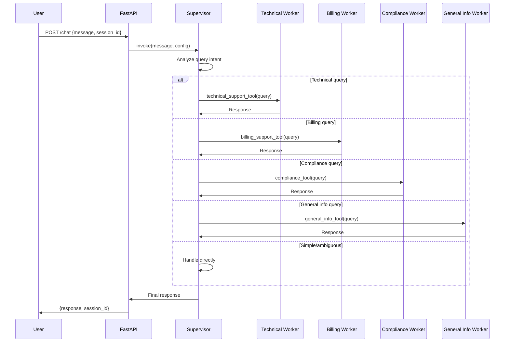

# PRD: Additional Worker Agents (Phase 4)

**Phase**: 4 of 6  
**Status**: Ready for Implementation  
**Priority**: High  
**Estimated Effort**: 4-5 days (with AI assistance: 1-2 days)  
**Dependencies**: Phase 3 (Multi-Agent Supervisor) ✅

---

## 1. Overview

### 1.1 Goals

Expand the multi-agent system by adding three additional specialized worker agents: Billing Support, Compliance, and General Information. Each worker provides domain-specific expertise and integrates with the existing supervisor agent through the proven tool-calling pattern established in Phase 3.

### 1.2 Objectives

- ✅ Create Billing Support worker for payment/invoice/subscription queries
- ✅ Create Compliance worker for policy/regulatory/legal questions  
- ✅ Create General Information worker for company info/FAQs/services
- ✅ Integrate all three workers with existing supervisor agent
- ✅ Update supervisor routing logic to handle 4 workers (technical + 3 new)
- ✅ Maintain conversation memory across all routing decisions
- ✅ Test routing accuracy with diverse query types

### 1.3 Success Metrics

- Supervisor correctly routes to all 4 workers (>85% accuracy)
- Each worker provides relevant, domain-specific responses
- No overlap or confusion between worker domains
- Conversation context maintained across all routing scenarios
- All automated tests pass (target: 80+ tests, >65% coverage)
- Manual testing scenarios validate all 4 workers

---

## 2. Technical Architecture

### 2.1 System Design

**Current Architecture (Phase 3):**
```
User → Backend → Supervisor Agent
                      ↓
              Technical Support Worker
                      ↓
                  Response
```

**New Architecture (Phase 4):**
```
User → Backend → Supervisor Agent
                      ↓
      ├─→ Technical Support (Phase 3 ✅)
      ├─→ Billing Support (Phase 4)
      ├─→ Compliance (Phase 4)
      └─→ General Information (Phase 4)
                      ↓
                  Response
```

### 2.2 Components

#### 2.2.1 Billing Support Worker
- **Purpose**: Handle payment, invoice, subscription, and refund queries
- **Model**: `openai:gpt-4o-mini`
- **Domain Expertise**:
  - Payment processing and methods
  - Invoice generation and access
  - Subscription management (upgrade, downgrade, cancel)
  - Billing cycles and due dates
  - Refund requests and policies
  - Pricing information
  - Account balance inquiries
  - Payment failed errors
- **System Prompt Focus**: Financial accuracy, policy compliance, empathy for billing issues
- **Tool Name**: `billing_support_tool`

**Example Queries:**
- "How do I update my payment method?"
- "I was charged twice, need a refund"
- "When is my next billing date?"
- "How much does the premium plan cost?"

#### 2.2.2 Compliance Worker
- **Purpose**: Answer policy, regulatory, legal, and compliance questions
- **Model**: `openai:gpt-4o-mini`
- **Domain Expertise**:
  - Terms of service
  - Privacy policy (GDPR, CCPA)
  - Data retention and deletion
  - Cookie policy
  - Acceptable use policy
  - Service level agreements (SLA)
  - Regulatory compliance (industry-specific)
  - Legal disclaimers
- **System Prompt Focus**: Accuracy, clarity, official policy adherence
- **Tool Name**: `compliance_tool`

**Example Queries:**
- "What data do you collect about me?"
- "How do I delete my account?"
- "What are your terms of service?"
- "Is this GDPR compliant?"

#### 2.2.3 General Information Worker
- **Purpose**: Provide company info, service descriptions, FAQs, and general help
- **Model**: `openai:gpt-4o-mini`
- **Domain Expertise**:
  - Company background and mission
  - Service offerings and features
  - Getting started guides
  - Best practices
  - Feature comparisons
  - General "how-to" questions
  - Non-technical support
  - General inquiries not covered by other workers
- **System Prompt Focus**: Helpful, informative, guiding users to resources
- **Tool Name**: `general_info_tool`

**Example Queries:**
- "What services do you offer?"
- "How do I get started?"
- "Tell me about your company"
- "What's the difference between plans?"

#### 2.2.4 Supervisor Agent (Updated)
- **Purpose**: Analyze queries and route to appropriate worker (now 4 options)
- **Model**: `openai:gpt-4o-mini`
- **Tools**: 
  - `technical_support_tool` (Phase 3)
  - `billing_support_tool` (Phase 4)
  - `compliance_tool` (Phase 4)
  - `general_info_tool` (Phase 4)
- **Memory**: Shared `InMemorySaver` checkpointer
- **Routing Logic**:
  ```
  Query Analysis
      ↓
  ├─→ Technical? → technical_support_tool
  ├─→ Billing/payment? → billing_support_tool
  ├─→ Policy/legal? → compliance_tool
  ├─→ General info? → general_info_tool
  └─→ Ambiguous/simple? → Handle directly
  ```

### 2.3 Routing Decision Matrix

| Query Type | Worker | Examples |
|-----------|--------|----------|
| **Errors, bugs, crashes** | Technical Support | "Error 500", "App crashes", "Can't install" |
| **Payments, invoices** | Billing Support | "Charged twice", "Update payment method", "Refund" |
| **Policies, legal** | Compliance | "Terms of service", "Privacy policy", "Delete account" |
| **Company, services, FAQs** | General Info | "What do you offer?", "How to get started", "About us" |
| **Greetings, thanks** | Direct (Supervisor) | "Hello", "Thank you", "Goodbye" |

### 2.4 Data Flow



---

## 3. Implementation Details

### 3.1 File Structure

```
backend/
├── agents/
│   ├── __init__.py (update: no changes needed)
│   ├── supervisor_agent.py (update: new tools, updated prompt)
│   └── workers/
│       ├── __init__.py (update: export new workers)
│       ├── technical_support.py (Phase 3 ✅)
│       ├── billing_support.py (NEW)
│       ├── compliance.py (NEW)
│       └── general_info.py (NEW)
├── tests/
│   ├── test_supervisor.py (update: test with 4 tools)
│   ├── test_technical_worker.py (Phase 3 ✅)
│   ├── test_billing_worker.py (NEW)
│   ├── test_compliance_worker.py (NEW)
│   ├── test_general_info_worker.py (NEW)
│   └── test_main.py (update: routing tests for all workers)
```

### 3.2 Worker Pattern (Consistent Across All 3 New Workers)

Each worker follows the same pattern established in Phase 3:

```python
# backend/agents/workers/[worker_name].py

from langchain.agents import create_agent
from langchain.tools import tool
from langgraph.checkpoint.memory import InMemorySaver
import logging
import os

logger = logging.getLogger(__name__)

def create_[worker]_agent():
    """Create [domain] worker agent."""
    api_key = os.getenv("OPENAI_API_KEY")
    if not api_key:
        raise ValueError("OPENAI_API_KEY must be set")
    
    checkpointer = InMemorySaver()
    
    system_prompt = """You are a [domain] specialist.
    Your role is to...
    
    CRITICAL: The supervisor only sees your final message.
    Include ALL results, findings, and details in your final response.
    """
    
    agent = create_agent(
        model="openai:gpt-4o-mini",
        tools=[],
        system_prompt=system_prompt,
        name="[worker]_agent",
    )
    
    logger.info(f"[Worker] agent created successfully")
    return agent

# Module-level singleton
_agent_instance = None

def get_[worker]_agent():
    """Get singleton instance of worker agent."""
    global _agent_instance
    if _agent_instance is None:
        _agent_instance = create_[worker]_agent()
    return _agent_instance

# Tool wrapper for supervisor
@tool
def [worker]_tool(query: str) -> str:
    """[Clear description of when to use this tool].
    
    Use this tool when users ask about [specific topics].
    """
    logger.info(f"[Worker] tool called with query: {query[:50]}...")
    
    agent = get_[worker]_agent()
    result = agent.invoke({"messages": [{"role": "user", "content": query}]})
    response = result["messages"][-1].content
    
    logger.info(f"[Worker] tool returning response: {response[:50]}...")
    return response
```

### 3.3 Supervisor Updates

**File**: `backend/agents/supervisor_agent.py`

**Changes Needed**:
1. Import new tools:
   ```python
   from agents.workers import (
       technical_support_tool,
       billing_support_tool,
       compliance_tool,
       general_info_tool,
   )
   ```

2. Register all tools:
   ```python
   tools = [
       technical_support_tool,
       billing_support_tool,
       compliance_tool,
       general_info_tool,
   ]
   ```

3. Update system prompt:
   ```python
   system_prompt = """You are a supervisor agent...
   
   Your worker specialists:
   1. Technical Support - errors, bugs, crashes, installation, performance
   2. Billing Support - payments, invoices, subscriptions, refunds, pricing
   3. Compliance - policies, privacy, terms, legal, data deletion
   4. General Information - company info, services, FAQs, getting started
   
   Routing guidelines:
   - Route technical problems to Technical Support
   - Route payment/billing questions to Billing Support
   - Route policy/legal questions to Compliance
   - Route general inquiries to General Information
   - Handle simple greetings/thanks directly yourself
   ...
   """
   ```

### 3.4 Testing Strategy

#### 3.4.1 Unit Tests (Per Worker)

Each worker gets ~15-20 unit tests:
- Worker creation and configuration
- Tool wrapper functionality
- Response generation
- System prompt validation
- Error handling (missing API key)
- Logging behavior
- Singleton pattern

**Target**: 60+ new unit tests (20 per worker × 3)

#### 3.4.2 Integration Tests

Add routing tests for each worker:
- Billing query routes to billing worker
- Compliance query routes to compliance worker
- General info query routes to general info worker
- Mixed conversation with all 4 workers
- Context maintenance across different worker types
- Supervisor handles ambiguous queries appropriately

**Target**: 15+ new integration tests

#### 3.4.3 Manual Testing

Test scenarios for each worker:
- 5 billing scenarios
- 5 compliance scenarios
- 5 general info scenarios
- 5 mixed routing scenarios

---

## 4. System Prompts

### 4.1 Billing Support Worker Prompt

```
You are a Billing Support specialist with expertise in payment processing, subscriptions, and financial inquiries.

Your role is to:
- Assist with payment method updates and processing
- Help users understand their invoices and charges
- Manage subscription changes (upgrade, downgrade, cancellation)
- Process refund requests and explain refund policies
- Clarify pricing and billing cycles
- Resolve billing errors and disputes
- Provide account balance information

Guidelines:
- Be empathetic with billing issues and concerns
- Explain financial matters clearly and accurately
- Follow company billing policies strictly
- Offer alternatives when possible (e.g., payment plans)
- Escalate complex financial issues appropriately
- Never make promises about refunds without policy verification

CRITICAL: The supervisor only sees your final message.
Include ALL billing details, amounts, dates, and next steps in your final response.
```

### 4.2 Compliance Worker Prompt

```
You are a Compliance specialist with expertise in policies, regulations, privacy, and legal matters.

Your role is to:
- Explain terms of service and policies clearly
- Answer privacy and data protection questions (GDPR, CCPA)
- Guide users through data deletion requests
- Clarify acceptable use policies
- Provide information about regulatory compliance
- Explain service level agreements (SLAs)
- Direct users to official policy documents

Guidelines:
- Be accurate and cite official policies
- Use clear, non-legal language when possible
- Never provide legal advice (you provide information only)
- Direct users to proper channels for formal requests
- Maintain a professional, official tone
- Update users on their rights clearly

CRITICAL: The supervisor only sees your final message.
Include ALL policy details, links, and next steps in your final response.
```

### 4.3 General Information Worker Prompt

```
You are a General Information specialist with expertise in company services, features, and general support.

Your role is to:
- Provide information about company background and mission
- Explain service offerings and features
- Guide new users through getting started
- Answer "how-to" questions for basic usage
- Compare different service plans
- Direct users to appropriate resources
- Handle general inquiries and FAQs

Guidelines:
- Be friendly, welcoming, and helpful
- Provide clear, actionable information
- Offer examples and use cases when relevant
- Guide users to next steps
- If question is technical, billing, or policy-related, note that specialized help is available
- Keep responses informative but concise

CRITICAL: The supervisor only sees your final message.
Include ALL relevant information, links, and recommended next steps in your final response.
```

---

## 5. Quality Assurance

### 5.1 Testing Requirements

**Unit Tests**:
- ✅ 60+ new unit tests for 3 workers
- ✅ All workers tested independently
- ✅ Tool wrappers tested
- ✅ Error handling validated

**Integration Tests**:
- ✅ 15+ routing tests for all workers
- ✅ Context maintenance across worker types
- ✅ Mixed conversations validated
- ✅ All mocked (no token usage)

**Manual Tests**:
- ✅ 20+ manual test scenarios
- ✅ Each worker validated independently
- ✅ Routing accuracy verified
- ✅ Response quality assessed

### 5.2 Acceptance Criteria

**Per Worker**:
- ✅ Worker agent created successfully
- ✅ Tool wrapper functional
- ✅ Responds to domain-specific queries
- ✅ Maintains context in conversation
- ✅ Error handling works
- ✅ Logging is comprehensive

**Supervisor Integration**:
- ✅ All 4 workers registered with supervisor
- ✅ Routing logic updated
- ✅ Tool descriptions clear and specific
- ✅ No routing confusion or overlap
- ✅ Handles ambiguous queries gracefully

**System-wide**:
- ✅ All tests passing (80+ tests total)
- ✅ Test coverage >65%
- ✅ No linting errors
- ✅ Documentation complete
- ✅ Manual testing scenarios pass

### 5.3 Documentation Requirements

- ✅ Backend README updated with all 4 workers
- ✅ Each worker module has comprehensive docstrings
- ✅ System prompts documented
- ✅ Routing logic clearly explained
- ✅ Manual testing guide updated with new scenarios

---

## 6. Timeline

### 6.1 Development Phases

**Phase 4.1: Billing Support Worker (3-4 hours)**
- Create billing_support.py module
- Implement billing agent and tool
- Write unit tests (20 tests)
- Test independently

**Phase 4.2: Compliance Worker (3-4 hours)**
- Create compliance.py module
- Implement compliance agent and tool
- Write unit tests (20 tests)
- Test independently

**Phase 4.3: General Information Worker (3-4 hours)**
- Create general_info.py module
- Implement general info agent and tool
- Write unit tests (20 tests)
- Test independently

**Phase 4.4: Supervisor Integration (2-3 hours)**
- Update supervisor with all 4 tools
- Update system prompt with routing logic
- Test supervisor with all workers
- Update supervisor unit tests

**Phase 4.5: Integration Testing (2-3 hours)**
- Write routing integration tests
- Test mixed conversations
- Verify context maintenance
- Test edge cases

**Phase 4.6: Documentation & Manual Testing (2-3 hours)**
- Update backend README
- Update root README
- Create manual test scenarios
- Validate all scenarios

**Total Estimated Time: 15-21 hours (2-3 days)**  
**With AI Assistance: 8-12 hours (1-1.5 days)**

---

## 7. Risk Assessment

### 7.1 Technical Risks

| Risk | Probability | Impact | Mitigation |
|------|------------|--------|------------|
| Routing confusion with 4 workers | Medium | High | Clear tool descriptions, distinct domains |
| Worker domain overlap | Medium | Medium | Define clear boundaries, test edge cases |
| Increased latency with more workers | Low | Low | All workers use fast gpt-4o-mini |
| Context loss across complex routing | Low | Medium | Verify checkpointer works with all workers |

### 7.2 Mitigation Strategies

1. **Routing Confusion:**
   - Write very specific tool descriptions
   - Test with ambiguous queries
   - Use LangSmith tracing to debug
   - Iterate on supervisor prompt if needed

2. **Domain Overlap:**
   - Document clear boundaries between workers
   - Technical vs Billing: Technical errors vs payment issues
   - Billing vs Compliance: Charges vs refund policies
   - General Info vs others: Generic info vs specific help
   - Test edge cases explicitly

3. **Performance:**
   - Monitor response times
   - Log routing decisions
   - Optimize if needed (though gpt-4o-mini is fast)

---

## 8. Dependencies

### 8.1 Prerequisites
- ✅ Phase 3 complete (supervisor + technical worker)
- ✅ LangChain v1.0 installed
- ✅ OpenAI API access
- ✅ Testing infrastructure established

### 8.2 External Dependencies
- LangChain v1.0+
- LangGraph v1.0+
- OpenAI API (gpt-4o-mini)
- All Phase 3 dependencies

---

## 9. Success Criteria Summary

**Phase 4 is complete when:**

1. **Code Complete**:
   - ✅ 3 new worker agents created
   - ✅ All workers wrapped as tools
   - ✅ Supervisor updated with 4 tools
   - ✅ All exports and imports correct

2. **Testing Complete**:
   - ✅ 60+ new unit tests (all passing)
   - ✅ 15+ integration tests (all passing)
   - ✅ 80+ total tests in Phase 4
   - ✅ Test coverage >65%
   - ✅ 20+ manual test scenarios validated

3. **Quality Assurance**:
   - ✅ No linting errors
   - ✅ All pre-commit hooks passing
   - ✅ CI/CD pipeline green
   - ✅ Routing accuracy >85%

4. **Documentation**:
   - ✅ Backend README updated
   - ✅ Root README updated
   - ✅ Manual testing guide updated
   - ✅ All prompts documented

5. **System Validation**:
   - ✅ All 4 workers respond correctly to domain queries
   - ✅ Supervisor routes accurately
   - ✅ No domain confusion or overlap
   - ✅ Context maintained across all routing
   - ✅ Performance acceptable (<4s response time)

---

## 10. Future Considerations (Phase 5+)

**Not in scope for Phase 4, but planned:**
- RAG/CAG with document retrieval for workers
- Real document repositories for each domain
- Long-term memory (PostgreSQL checkpointer)
- Streaming responses
- AWS Bedrock integration
- Additional workers (escalation, sales, etc.)

**Phase 4 establishes:**
- Proven pattern for adding workers
- Scalable routing architecture
- Clear domain boundaries
- Foundation for RAG integration in Phase 5

---

**Version**: 1.0.0 (Phase 4)  
**Created**: November 4, 2025  
**Status**: Ready for Implementation  
**Dependencies**: Phase 3 Complete ✅  
**Next Phase**: Phase 5 (RAG/CAG with Document Retrieval)

